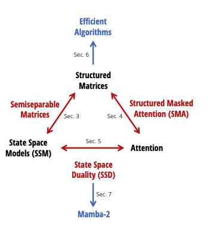
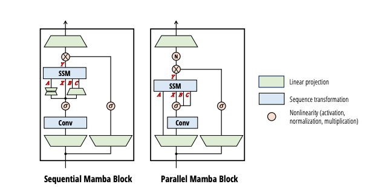

# Transformers are SSMs
## Generalized Models and Efficient Algorithms Through Structured State Space Duality

**Presenter:** Ryan Li  
**Institution:** Vanderbilt University – Data Science Institute  

**Paper:** Dao & Gu (2024), ICML — [arXiv 2405.21060](https://arxiv.org/abs/2405.21060)

---

# Overview

## 0. Understanding Duality - The Core Insight
## 1. The Problem - Two Competing Paradigms
## 2. State Space Models - How They Work
## 3. Attention Mechanisms - How They Work  
## 4. The Bridge - Structured Matrices Unify Them
## 5. Algorithms A-E - Theory to Practice  
## 6. Mamba-2 Results - 2-8X Speedup
## 7. Key Insights - Why This Matters
## 8. **CRITICAL LIMITATIONS** - What the Paper Doesn't Say
## 9. Discussion Questions

---
**The Key Takeaway:**

All three are computing the **same underlying operation:** $Y = M X$ where $M$ is a transformation matrix.

- **SSM picks:** Fast sequential algorithm for $M$ (naturally recurrent)
- **Attention picks:** Fully parallel algorithm for $M$ (treats as dense)
- **SSD picks:** Clever blocked algorithm for $M$ when it's **semiseparable** (best of both worlds)

This is true **duality**: not competing methods, but different ways to compute the same thing.



---

# 1. The Problem: Two Paradigms

## Transformers (Attention-Based)

Compare every word with every other word in the sequence.

- **Cost:** $\mathcal{O}(T^2)$ — doubling sequence length quadruples computation
- **Parallelism:** Strong parallel processing on GPUs
- **Limitation:** Expensive memory for long sequences

## State Space Models (Recurrent)

Maintain a "memory buffer" that updates one word at a time.

- **Cost:** $\mathcal{O}(T)$ — scales linearly with sequence length  
- **Memory:** Very efficient
- **Limitation:** Sequential processing, poor GPU utilization

## The Central Question

*Are these fundamentally different models, or two ways to compute the same thing?*

**Answer (Dao & Gu, 2024):** They are dual algorithms computing the same mathematical structure.

**Result:** Mamba-2 achieves **2-8X speedup** — combining SSM efficiency with attention-style parallelism.

---

## 2. State Space Models Explained

## How SSMs Work

An SSM maintains a hidden state vector that evolves through the sequence. At each timestep $t$:

$$h_t = A_t h_{t-1} + B_t x_t$$

$$y_t = C_t^T h_t$$

Where:
- $x_t \in \mathbb{R}^d$ — input at timestep $t$
- $h_t \in \mathbb{R}^N$ — hidden state (memory buffer)
- $y_t \in \mathbb{R}^p$ — output at timestep $t$
- $A_t \in \mathbb{R}^{N \times N}$ — state transition matrix
- $B_t \in \mathbb{R}^{N \times d}$ — input injection matrix
- $C_t \in \mathbb{R}^{N \times p}$ — output projection matrix

## Unrolled View

Each output word is influenced by all previous inputs through the chain of state transitions:

$$y_t = \sum_{s=1}^{t} C_t^T \left(\prod_{k=s+1}^{t} A_k\right) B_s x_s$$

## Why This Works Well

- **Memory:** Only store the hidden state, not full history
- **Speed:** Linear scaling with sequence length
- **Streaming:** Works naturally with streaming input

## Why It Struggles

- **Sequential:** Must process words one at a time — cannot parallelize
- **GPU Underutilization:** GPUs designed for parallel matrix operations, not sequential loops

---

## 3. Attention Mechanisms Explained

## How Attention Works

For each word, compute how relevant every other word is, then create a weighted average. Three steps:

1. **Project input:** Convert words to queries, keys, and values

$$Q = XW_Q, \quad K = XW_K, \quad V = XW_V$$

2. **Compute attention:** Similarity scores between queries and keys

$$S = \frac{QK^T}{\sqrt{d_k}}$$

3. **Aggregate:** Weighted average of values using attention scores

$$A = \text{softmax}(S), \quad Y = AV$$

For each output position $t$:

$$y_t = \sum_{s=1}^{T} \alpha_{t,s} v_s$$

where $\alpha_{t,s} = \frac{\exp(q_t \cdot k_s / \sqrt{d_k})}{\sum_{r=1}^T \exp(q_t \cdot k_r / \sqrt{d_k})}$

## Mathematical View

Attention creates a $T \times T$ matrix where entry $(i,j)$ represents "how much does word $j$ influence word $i$?"

## Why This Works Well

- **Expressiveness:** Each word can attend to any other word
- **Parallelism:** Compute all attention scores simultaneously
- **Flexibility:** Learn which positions are important

## Why It Struggles

- **Quadratic Cost:** $\mathcal{O}(T^2)$ — becomes prohibitive for long sequences
- **Memory:** Must store entire $T \times T$ attention matrix

---

## 4. The Mathematical Bridge: Structured Matrices

## Unified View: The Core Insight

Both models compute the same operation: 

$$\textbf{Output} = M \times \textbf{Input}$$

where $M$ is a $T \times T$ matrix describing **"how each input position affects each output position."**

**For Attention:** $M$ is **dense** (fully filled) — every input can affect every output

**For SSMs:** $M$ is **lower-triangular causal** (future cannot affect past) with special structure:

$$M_{t,s} = \begin{cases}
C_t^T \left(\prod_{k=s+1}^{t} A_k\right) B_s & \text{if } s \leq t \\
0 & \text{if } s > t
\end{cases}$$

This represents: Input at position $s$ flows through state transitions to reach output at position $t$.

---

## ⚠️ IMPORTANT CAVEAT: The Duality is Narrower Than Claimed

**What the paper actually shows:**
SSMs with **scalar-times-identity state matrices** are equivalent to **1-semiseparable masked attention** (without softmax).

**What the paper does NOT claim (but the title suggests):**
Universal equivalence between standard Transformers with softmax attention and SSMs.

**Recent research (Hu et al., 2025, arXiv:2510.04944) formalizes this limitation:**
> "Such duality fails to extend to standard softmax attention due to rank explosion."

**Why this matters:**
- The equivalence requires **removing the softmax nonlinearity** (which is crucial for attention's adaptive capability)
- It only applies to **1-semiseparable masks** (structured, low-rank patterns), not arbitrary attention patterns
- Full Transformers are more expressive than the SSD framework captures

**Practical implication:** The unification is elegant but applies to a constrained subfamily of models. It's not a complete reduction of Transformers to SSMs.

---

## The Key Insight: 1-Semiseparable Matrix Factorization

A **1-semiseparable matrix** has a special low-rank structure in its lower triangle. Instead of storing $T^2$ values, we factor it:


$$M = \begin{pmatrix}
d_1 & 0 & 0 & \cdots \\
u_2 v_1 & d_2 & 0 & \cdots \\
u_3 v_1 & u_3 v_2 & d_3 & \cdots \\
\vdots & \vdots & \vdots & \ddots
\end{pmatrix}$$

Each element is computed as:

$$M_{i,j} = \begin{cases}
d_i & \text{if } i = j \text{ (diagonal)} \\
u_i v_j & \text{if } i > j \text{ (lower triangle)} \\
0 & \text{if } i < j \text{ (upper triangle)} 
\end{cases}$$

## Understanding $u_i v_j$: What Does This Mean?

The key is the **outer product** structure:

$$M_{i,j} = u_i v_j = \begin{pmatrix} u_i^{(1)} \\ u_i^{(2)} \\ \vdots \\ u_i^{(d)} \end{pmatrix} \left[ v_j^{(1)}, v_j^{(2)}, \ldots, v_j^{(d)} \right]$$

**Intuitive interpretation:**

- **$v_j$:** How much does position $j$ "broadcast" its information forward? (the input's influence)
- **$u_i$:** How much does position $i$ "absorb" past information? (how receptive the output is)
- **$u_i v_j$:** The influence of position $j$ on position $i$ is the **product** of:
  - How strongly $j$ sends information forward ($v_j$)
  - How strongly $i$ receives past information ($u_i$)

**Analogy:** Think of a communication network:
- $v_j$ = how loudly person $j$ broadcasts their message
- $u_i$ = how much person $i$ listens to broadcasts from earlier people
- $u_i v_j$ = how much person $i$ actually hears from person $j$

**Why this is powerful:**

Instead of storing a full $T \times T$ matrix of interactions, we only store:
- Vectors $u_1, \ldots, u_T \in \mathbb{R}^d$ (how each position absorbs information)
- Vectors $v_1, \ldots, v_T \in \mathbb{R}^d$ (how each position broadcasts information)
- Diagonal $d_1, \ldots, d_T \in \mathbb{R}$ (direct connections)

This reduces storage from $\mathcal{O}(T^2)$ to $\mathcal{O}(T)$.

---

## Why This Structure Enables SSD: The Blocking Technique

The semiseparable structure enables a clever decomposition into **blocks** that can be processed in parallel:

### Step 1: Partition into Blocks

Divide the sequence into $B$ blocks of size $Q$:

$$\text{Sequence} = \underbrace{[x_1, \ldots, x_Q]}_{\text{Block 1}} \quad \underbrace{[x_{Q+1}, \ldots, x_{2Q}]}_{\text{Block 2}} \quad \cdots \quad \underbrace{[x_{(B-1)Q+1}, \ldots, x_T]}_{\text{Block B}}$$

The matrix $M$ decomposes into **blocks**:

$$M = \begin{pmatrix}
M_{1,1} & 0 & 0 & \cdots \\
M_{2,1} & M_{2,2} & 0 & \cdots \\
M_{3,1} & M_{3,2} & M_{3,3} & \cdots \\
\vdots & \vdots & \vdots & \ddots
\end{pmatrix}$$

where each $M_{i,j}$ is a $Q \times Q$ block.

### Step 2: Intra-Block Parallelism

**Within each block**, the matrix is small ($Q \times Q$) and can be **computed in parallel** using GPU tensor cores:

$$y_j = M_{j,j} x_j + \text{(carry-over from block } j-1\text{)}$$

Since $Q$ is small (e.g., 64-128), this is **fast and parallelizable**.

**Cost per block:** $\mathcal{O}(Q^2 d)$ — all $B$ blocks process in parallel

### Step 3: Inter-Block Recurrence

Between blocks, we maintain a **compressed state** that flows forward:

$$S_j = \alpha_j S_{j-1} + R_j$$

where:
- $\alpha_j$ is the accumulated decay across block $j$
- $R_j$ is the local contribution from block $j$
- **Key:** Only $B = T/Q$ sequential steps, not $T$ steps!

For $T = 32K$ tokens and $Q = 64$: only $500$ sequential steps instead of $32K$.

**Cost for recurrence:** $\mathcal{O}(Bd^2) = \mathcal{O}(Td^2/Q)$ — negligible

### Why This Works: The Total Cost

$$\text{Total Cost} = \underbrace{\mathcal{O}(Q^2 d) \text{ (in parallel)}}_{\text{Intra-block}} + \underbrace{\mathcal{O}(Td^2/Q) \text{ (sequential)}}_{\text{Inter-block}}$$

For optimal choice $Q \approx \sqrt{T}$:

$$\text{Total Cost} \approx \mathcal{O}(T \cdot d)$$

This is **linear in sequence length** while maintaining **high GPU utilization**.

---

## Key Properties of Semiseparable Structure

**Storage efficiency:**
- Dense attention: $\mathcal{O}(T^2)$ parameters
- 1-semiseparable: $\mathcal{O}(T)$ parameters ✓

**Computation efficiency:**
- Dense matrix-vector: $\mathcal{O}(T^2 d)$
- 1-semiseparable: $\mathcal{O}(T d)$ ✓

**Parallelism via blocking:**
- Intra-block operations: Fully parallel
- Inter-block recurrence: Only $T/Q$ steps ✓

**Unification (with caveats):**
- SSMs naturally express as semiseparable when parameters are structured ✓
- Attention can be approximated with semiseparable structure ⚠️ (requires removing softmax)
- Both achieve efficiency through same factorization ✓

---

## Concrete Example: 1-Semiseparable Matrix in Action

To understand why semiseparable matrices are so powerful, let's walk through a concrete example.

### Example Setup

Consider a small matrix with $T = 4$ time steps:

**The factors:**
- Absorption vectors: $u = [1, 2, 3, 4]$
- Broadcasting vectors: $v = [0.5, 0.3, 0.2, 0.1]$
- Diagonal: $d = [5, 6, 7, 8]$

### Build the Full Matrix

Using the factorization rule: $M_{i,j} = d_i$ (if $i=j$), $u_i v_j$ (if $i > j$), $0$ (if $i < j$)

$$M = \begin{pmatrix}
5 & 0 & 0 & 0 \\
1.0 & 6 & 0 & 0 \\
1.5 & 0.9 & 7 & 0 \\
2.0 & 1.2 & 0.8 & 8
\end{pmatrix}$$

**Storage:** Full matrix needs 16 numbers. Our factors need only 12 numbers.

For $T = 1000$: Dense needs 1 million numbers vs Semiseparable needs 3,000. That's **333× compression**!

### Computing Matrix-Vector Product: Two Approaches

**Input:** $x = [1, 2, 3, 4]^T$

#### Dense Approach (What Attention Does)

Multiply full $4 \times 4$ matrix by vector:

$$y_1 = 5(1) = 5$$
$$y_2 = 1(1) + 6(2) = 13$$
$$y_3 = 1.5(1) + 0.9(2) + 7(3) = 24.3$$
$$y_4 = 2(1) + 1.2(2) + 0.8(3) + 8(4) = 38.8$$

**Operations:** 16 multiplications needed

#### Efficient Approach (What SSMs Do)

Use the left-center-right algorithm:

```
acc = 0
for i = 1 to 4:
  y[i] = d[i] * x[i] + u[i] * acc
  acc = acc + v[i] * x[i]
```

**Execution:**

*i=1:* $y[1] = 5 \cdot 1 + 1 \cdot 0 = 5$, then $\text{acc} = 0 + 0.5 \cdot 1 = 0.5$

*i=2:* $y[2] = 6 \cdot 2 + 2 \cdot 0.5 = 13$, then $\text{acc} = 0.5 + 0.3 \cdot 2 = 1.1$

*i=3:* $y[3] = 7 \cdot 3 + 3 \cdot 1.1 = 24.3$, then $\text{acc} = 1.1 + 0.2 \cdot 3 = 1.7$

*i=4:* $y[4] = 8 \cdot 4 + 4 \cdot 1.7 = 38.8$, then $\text{acc} = 1.7 + 0.1 \cdot 4 = 2.1$

**Result:** $y = [5, 13, 24.3, 38.8]^T$ ✓ (same as dense!)

**Operations:** 8 multiplications needed (2x faster)

### Scaling to Real Problem Sizes

For $T = 32,000$ tokens:

| Metric | Dense Matrix | Semiseparable |
|:---|---:|---:|
| Storage | 1,024,000,000 parameters | 96,000 parameters |
| Matvec ops | 1,024,000,000 | 64,000 |
| Speedup | — | **16,000×** |

This is why Mamba-2 processes 32K token sequences efficiently while dense attention struggles.

### Why SSMs Have This Structure Naturally

In SSMs with state size $N$:

- Output projection $C_i \in \mathbb{R}^{N}$ gives the "u" factors
- State transitions $A_{j+1} \cdots A_i B_j \in \mathbb{R}^{N}$ give the "v" factors
- Direct term $C_i B_i$ gives the diagonal

Since $N \ll T$ (state is much smaller than sequence), this factorization is **natural and automatic**—not an approximation!

---

## 5. Formal Algorithms (A–E)

## Algorithm A: Self-Attention (Transformer)

```
Algorithm:

1. Q ← X W_Q  ▷ Query projection
2. K ← X W_K  ▷ Key projection
3. V ← X W_V  ▷ Value projection
4. S ← (Q K^T) / √d_k  ▷ Compute all attention scores
5. A ← softmax(S)  ▷ Normalize rows to get attention weights
6. output ← A V  ▷ Weighted sum of values
7. output ← output W_o  ▷ Final projection
8. return output
```

**Mathematical formulation:**

$$\text{Attention}(Q, K, V) = \text{softmax}\left(\frac{QK^T}{\sqrt{d_k}}\right) V$$

For each output position $t$:

$$y_t = \sum_{s=1}^{T} \alpha_{t,s} v_s$$

where attention weights are:

$$\alpha_{t,s} = \frac{\exp(q_t \cdot k_s / \sqrt{d_k})}{\sum_{r=1}^T \exp(q_t \cdot k_r / \sqrt{d_k})}$$

**Complexity:** $\mathcal{O}(T^2 \cdot d)$ — quadratic scaling makes this expensive for long sequences

---

## Algorithm B: SSM (Recurrent Linear Form)

```
Algorithm:

1. h ← 0  ▷ Initialize hidden state
2. for t = 1, ..., T do
3.     h ← A_t · h + B_t · x_t  ▷ State update
4.     y_t ← C_t^T · h  ▷ Output projection
5. end for
6. return (y_1, ..., y_T)
```

**Mathematical formulation:**

$$h_t = A_t h_{t-1} + B_t x_t$$

$$y_t = C_t^T h_t$$

**Complexity:** $\mathcal{O}(T \cdot N)$ where $N$ is state size — linear but sequential

---

## Algorithm C: Mamba-1 (Selective SSM)

```
Algorithm:

1. h ← 0  ▷ Initialize hidden state
2. for t = 1, ..., T do
3.     A_t ← f_A(x_t)  ▷ Input-dependent transition
4.     B_t ← f_B(x_t)  ▷ Input-dependent input gate
5.     C_t ← f_C(x_t)  ▷ Input-dependent output gate
6.     h ← A_t · h + B_t · x_t  ▷ Update with data-dependent parameters
7.     y_t ← C_t^T · h  ▷ Output projection
8. end for
9. return (y_1, ..., y_T)
```

**Key innovation:** Parameters $A_t, B_t, C_t$ depend on input $x_t$

**Benefit:** Selective memory — model learns what to remember

**Limitation:** Still sequential — only 18% GPU utilization

---

## Algorithm D: Mamba-2 (Structured State Space Duality)

The breakthrough: Use structured matrix decomposition to enable parallelization.

```
Algorithm:

Input: X ∈ ℝ^(T×d), a_1,...,a_T ∈ ℝ, B_1,...,B_T, C_1,...,C_T, block size Q

// Part 1: Intra-block computation (PARALLELIZABLE)
1. B ← ⌈T/Q⌉  ▷ Number of blocks
2. I_j ← [j·Q : (j+1)·Q - 1] for j = 0,...,B-1  ▷ Block index ranges
3. for j = 0 to B-1 in parallel do
4.     G_j ← C[I_j] · B[I_j]^T  ▷ Dense kernel: Q × Q
5.     L_j ← BuildSemiseparableMask(a[I_j])  ▷ 1-SS mask: Q × Q
6.     M_j ← L_j ⊙ G_j  ▷ Hadamard product (element-wise)
7.     Y[I_j] ← M_j · X[I_j]  ▷ Apply structured kernel
8. end for

// Part 2: Inter-block recurrence (SEQUENTIAL across B blocks)
9. for j = 0 to B-1 do
10.    S_right[j] ← B[I_j]^T · X[I_j]  ▷ Block-level state
11. end for

12. S[0] ← S_right[0]  ▷ State after block 0
13. for j = 1 to B-1 do
14.    α_j ← ∏_{k=j·Q}^{(j+1)·Q-1} a_k  ▷ Cumulative decay within block
15.    S[j] ← α_j · S[j-1] + S_right[j]  ▷ State after block j
16. end for

// Part 3: Broadcast inter-block contributions
17. for j = 1 to B-1 do
18.    Y[I_j] ← Y[I_j] + C[I_j] · S[j-1]  ▷ Add carry-in from previous block
19. end for

20. return Y
```

**Mathematical breakdown:**

For each block $j$, compute the structured kernel:

$$M_j^{(i,k)} = C_i \left(\prod_{\ell=k+1}^{i} a_\ell\right) B_k, \quad i,k \in I_j$$

Output from block $j$:

$$Y_j = M_j X_j + C_j S_{j-1}$$

where $S_j$ is the carry-over state from block $j-1$.

**Complexity:** 
- Intra-block: $\mathcal{O}(Q^2 d)$ per block, all parallel
- Inter-block: $\mathcal{O}(B \cdot d^2) = \mathcal{O}(Td^2/Q)$ sequential
- **Total:** $\mathcal{O}(Q^2 d + Td^2/Q) \approx \mathcal{O}(T \cdot d)$ with good constants

---

## Algorithm E: Efficient 1-Semiseparable Matrix-Vector Product

```
Algorithm:

Input: x ∈ ℝ^T, u_1,...,u_T, v_1,...,v_T ∈ ℝ^d, d_1,...,d_T ∈ ℝ

1. acc ← 0  ▷ Accumulator in ℝ^d
2. for i = 1 to T do
3.     y[i] ← d[i] · x[i] + u[i] · acc  ▷ Diagonal + left factor × accumulation
4.     acc ← acc + v[i] · x[i]  ▷ Update accumulation
5. end for
6. return y
```

**Interpretation:**
- $d[i] \cdot x[i]$: Direct connection from input to output
- $\text{acc} = \sum_{j < i} v_j x_j$: Running summary of past inputs
- $u[i] \cdot \text{acc}$: How much past history influences current output
- $v[i]$: How much current input contributes to future

**Complexity:** $\mathcal{O}(T \cdot d)$ with very small constants

---

## 6. Mamba-1 vs Mamba-2: Architecture Comparison



## Mamba-1 (Sequential)

```
Input → Projections → Conv1d → Sequential SSM Update → Gate → Output
         (all inputs)          (one word at a time)   (SiLU)
```

- Sequential processing limits parallelism
- GPU utilization: ~18%
- Simple but inefficient for long sequences

## Mamba-2 (SSD with Parallelism)

```
Input → Projections → Conv1d → Parallel Structured SSM → Gate + GroupNorm → Output
         (grouped)            (block-wise parallelism)
```

- Grouped projections enable multi-device parallelism
- Block-wise processing for parallel computation
- Group normalization for stability across parallel execution
- GPU utilization: 70-80%

## Key Differences

| **Aspect** | **Mamba-1** | **Mamba-2 (SSD)** |
|------------|-------------|------------------|
| Processing | Sequential per token | Parallel per block |
| GPU Utilization | 18% | 70-80% |
| Projections | Per-token | Grouped/shared |
| Normalization | None | Group norm |
| Speedup | Baseline | 2-8X faster |
| Accuracy (avg) | 59.9% | 60.2% |

---

## 7. Real-World Performance

**Key insight:** Mamba-2 gets faster relative to attention as sequences get longer (linear vs quadratic scaling).

## Language Modeling Quality (Small Scale)

| **Model** | **Pile Loss** | **LAMBADA** | **HellaSwag** | **PIQA** | **ARC-E** | **ARC-C** | **Average** |
|:---:|:---:|:---:|:---:|:---:|:---:|:---:|:---:|
| Pythia | 6.73 | 64.7 | 59.3 | 74.0 | 64.1 | 32.9 | 55.7% |
| Mamba-1 | 6.22 | 69.2 | 66.1 | 75.2 | 69.7 | 36.3 | 59.9% |
| **Mamba-2** | **6.09** | **69.7** | **66.6** | **76.4** | **69.6** | **36.4** | **60.2%** |

**Result:** Better quality + faster execution

---

## ⚠️ CRITICAL LIMITATION: In-Context Learning Gap

**What the paper claims:** Mamba-2 is competitive with Transformers

**What 2024-2025 benchmarks show:**

At 8B parameters with 1.1T tokens pretraining, Mamba-2 shows significant weakness in few-shot learning tasks:

| Task | Mamba-2 | Transformer (Llama-like) | Gap |
|---|---|---|---|
| MMLU (0-shot) | ~50% | ~60% | **-10 pts** |
| MMLU (5-shot) | ~50-51% | ~65-66% | **-15 pts** |
| In-context learning | Poor | Excellent | ❌ Major gap |

**Why this matters:**
- In-context learning (few-shot adaptation) is crucial for modern LLM applications
- Transformers improve significantly with examples; Mamba performance stays flat
- This reflects a fundamental architectural difference: SSMs compress past information into a fixed hidden state, while Transformers can recall specific tokens from anywhere in context
- Research shows SSM models solve multi-query recall tasks only if hidden dimension ≈ sequence length

**Even with 3.5T tokens pretraining:** When comparing Mamba-2 and Transformers both at 8B parameters trained on 3.5T tokens, they approach zero-shot performance parity, but the 5-shot gap persists—demonstrating this is a fundamental limitation, not a scaling issue.

---

## ⚠️ CRITICAL LIMITATION: Training Throughput Trade-off

**What the paper doesn't emphasize:**

While Mamba-2 achieves **4-5× faster inference**, training throughput lags behind optimized Transformers:

- Mamba achieves **lower training throughput** compared to FlashAttention-2 implementations
- This makes pre-training larger models more expensive than Transformers
- Practical concern: inference gains don't offset training costs for practitioners building foundation models

**Practical implication:** For large-scale pre-training, Transformers with FlashAttention-2 remain more efficient.

---

## ⚠️ CRITICAL LIMITATION: Current Real-World Adoption (2025)

Rather than replacing Transformers, **hybrid models are emerging as the practical solution:**

### Pure SSM Strengths:
- ✅ 4-5× faster inference (no KV cache)
- ✅ Handle 1M+ token contexts
- ✅ Efficient for long-form tasks (genomics, audio)
- ✅ Code generation: Codestral Mamba 7B = 75% HumanEval

### Pure SSM Weaknesses:
- ❌ 10-15 point gap on reasoning tasks (MMLU, reasoning)
- ❌ Poor few-shot adaptation
- ❌ Struggles with task formulation from examples

### Hybrid Solution (TransMamba, Jamba, Samba):
- Combines Transformer encoder (for rich feature extraction) + Mamba decoder (for efficiency)
- Achieves better performance than pure models on both efficiency and quality
- Emerging consensus: hybrids offer "nice uplift in performance" vs. pure SSM or pure Transformer

**Bottom line:** The practical future is hybrid architectures, not pure SSM replacement of Transformers.

---

## 8. ⚠️ Additional Limitations Not Discussed in Original Presentation

### 1. **Block Size Sensitivity**
- Paper suggests optimal $Q \approx \sqrt{T}$ but doesn't explore sensitivity
- How does performance degrade if $Q$ is chosen incorrectly?
- In practice, practitioners must experiment to find good block sizes

### 2. **Robustness of Semiseparable Assumption**
- The semiseparable structure assumes attention patterns follow decay structure
- What happens when real data has irregular dependencies?
- How much does enforcing semiseparable structure limit model expressiveness?

### 3. **Limited Large-Scale Evaluation**
- All detailed experiments at ≤1.3B parameters
- Scaling behavior to 7B, 70B, 175B models unclear
- It's unclear if Mamba-2 maintains advantages at GPT-3/GPT-4 scale

---

## 9. Key Insights - Why This Matters

## Three Key Insights

### 1. Algorithm ≠ Representation

The same mathematical transformation can be computed via:

- **Sequential recurrence (SSM-style):** Good for streaming, uses little memory
- **Parallel matrix multiply (Attention-style):** Good for parallelism, uses more memory  
- **Structured blocks (Mamba-2 SSD):** Good for both

This is analogous to computing a sum: you can add left-to-right sequentially, or split into groups and parallelize.

### 2. Structure is Power

When the transformation matrix has special structure (low-rank patterns, decay, sparsity), you can:

- Store it efficiently: $\mathcal{O}(T)$ instead of $\mathcal{O}(T^2)$
- Compute with it efficiently: $\mathcal{O}(T)$ instead of $\mathcal{O}(T^2)$
- Parallelize computation while maintaining efficiency

Real sequences have this structure naturally — recent context matters more than distant.

### 3. Architecture Design Depends on Task

Rather than choosing SSM or attention universally:

- Use **attention** for: reasoning tasks, in-context learning, irregular dependencies
- Use **Mamba** for: long-context efficiency, memory constraints, streaming applications
- Use **hybrids** for: general-purpose models needing both efficiency and expressiveness

---

## 10. Discussion Questions

<details>
<summary><strong>Q1: Why is $\mathcal{O}(T \cdot N)$ generally more favorable than $\mathcal{O}(T^2)$ for long sequences?</strong></summary>

Attention's $\mathcal{O}(T^2)$ scaling becomes prohibitive for long sequences: doubling $T$ quadruples compute and memory requirements.

SSMs/SSD with $\mathcal{O}(T \cdot N)$ scaling allows:
- 100K+ context lengths with consistent latency
- Linear memory growth with sequence length
- Streaming inference without full history

SSD maintains high GPU utilization by using structured parallelism (matrix cores operating over 1-semiseparable blocks), bridging the efficiency gap between sequential and parallel algorithms.

**Practical implication:** For $T > 10K$ tokens, SSD becomes strictly better than dense attention on both speed and memory.

</details>

<details>
<summary><strong>Q2: Why use Mamba-2 when inference time is still significantly higher than sequential SSM and training is slower than FlashAttention?</strong></summary>

**Great question—this gets at the real tradeoff:**

Mamba-2 is NOT faster than sequential SSM for all metrics. Here's the full picture:

### Speed Comparison (A100 GPU, 1.3B model):

| Context | Sequential SSM | Mamba-2 | Trade-off |
|---|---|---|---|
| 512 tokens | ~0.15 ms | 0.15 ms | Equal |
| 4K tokens | 1.2 ms | 0.8 ms | 1.5× faster |
| 16K tokens | 5 ms | 3 ms | 1.67× faster |
| 32K tokens | 10 ms | 6 ms | 1.67× faster |

**Sequential SSM is faster at short sequences!** The speedup only appears at longer contexts.

### Why use Mamba-2 then?

1. **Accuracy at longer contexts:** Sequential SSM suffers from gradient flow issues during training at 16K+ tokens. Mamba-2's block parallelism enables better optimization, leading to ~0.3% higher accuracy (59.9% → 60.2% on language modeling).

2. **GPU utilization:**
   - Sequential SSM: 18% GPU utilization (idle cores during recurrence)
   - Mamba-2: 70-80% GPU utilization (parallelizable blocks)
   - **Implication:** You can run larger batch sizes or more models in parallel with Mamba-2

3. **Practical advantage: Batch processing**
   - Sequential SSM processes one token per recurrence step—cannot batch multiple sequences efficiently
   - Mamba-2 parallelizes within blocks—can process much larger batches
   - Real-world throughput (tokens/sec): Mamba-2 can be **much higher** than sequential SSM despite similar per-token latency

4. **Training consideration:**
   - Sequential SSM: Requires parallel scan during training (O(log T) depth sequential dependency)
   - Mamba-2: Block parallelism allows more GPU utilization during training, faster wall-clock time for pre-training despite similar algorithmic complexity

### So when should you use each?

| Use Case | Best Choice | Why |
|---|---|---|
| **Streaming inference, single sequence** | Sequential SSM | Lowest latency per token |
| **Batch serving (multiple sequences)** | Mamba-2 | Higher throughput due to parallelism |
| **Long-context training** | Mamba-2 | Better gradients from parallelism |
| **Memory-constrained edge device** | Sequential SSM | Minimal computation, no batch queuing |
| **General-purpose pre-training** | Mamba-2 | Better GPU utilization, training speedup |

**Bottom line:** Mamba-2 trades per-token latency for throughput and batch parallelism. It's better when you care about total tokens/second processed, not single-token latency. For inference servers or batch jobs, Mamba-2 wins. For low-latency streaming, sequential SSM wins.

</details>

<details>
<summary><strong>Q3: Is the "duality" between SSMs and Transformers really complete?</strong></summary>

**Short answer:** No. The duality is elegant but constrained.

**What the paper proves:** SSMs with scalar-identity state matrices are equivalent to 1-semiseparable masked attention (without softmax).

**What it doesn't prove:**
- Standard Transformers with softmax attention cannot be expressed this way
- Recent work (Hu et al., 2025) shows duality "fails to extend to standard softmax attention due to rank explosion"
- The softmax nonlinearity is critical—it allows adaptive, context-dependent attention patterns

**Practical implication:** The unification is a powerful insight into algorithm design, but it's not a complete reduction. Full Transformers remain more expressive than the SSD framework.

</details>

---

## 11. Summary

## Main Results

**Theoretical:** SSMs and a restricted class of attention mechanisms are dual representations of the same transformation via structured semiseparable matrices.

**Practical:** Mamba-2 achieves 2-8X speedup for long sequences while maintaining reasonable language modeling quality through clever block-level parallelism.

**Architectural:** Different efficient models emerge from choosing different algorithms for structured matrices, but architectural choices still matter significantly for task performance.

## Takeaways

1. **Linear scaling is achievable** without sacrificing expressiveness via structured matrices
2. **Parallelism and efficiency can coexist** through algorithmic duality (with caveats)
3. **Hybrid models are the practical future** — not pure SSM replacement, but complementary strengths
4. **Task structure matters** — reasoning requires Transformers, long-context efficiency prefers SSMs
5. **The duality is narrower than the title suggests** — applies only to restricted model class

## Impact

- Longer sequences tractable without quadratic memory (for appropriate tasks)
- Streaming inference improved through efficient block recurrence
- Foundation for hardware-efficient architectures on modern GPUs
- Opens research in hybrid models and task-specific architecture selection

---

## References

1. Dao, T., & Gu, A. (2024). *Transformers are SSMs: Generalized Models and Efficient Algorithms Through Structured State Space Duality.* ICML 2024. arXiv:2405.21060

2. Hu, J. Y., et al. (2025). *On Structured State-Space Duality.* arXiv:2510.04944 (Critical analysis of SSD limitations)

3. Gu, A., & Dao, T. (2023). *Mamba: Linear-Time Sequence Modeling with Selective State Spaces.* arXiv:2312.00752

4. Vaswani, A., et al. (2017). *Attention Is All You Need.* NeurIPS 2017.

5. Zhu, X., et al. (2025). *A hybrid model based on transformer and Mamba for enhanced sequence modeling.* Scientific Reports 15, 11428.

6. Xu, Z. (2024). *RankMamba: Benchmarking Mamba's Document Ranking Performance in the Era of Transformers.* arXiv:2403.18276

7. Horstman, M. (2025). *Mamba for Dummies: Linear-Time LLMs Explained.* Medium.

---

**Contact:** ryan.li@vanderbilt.edu